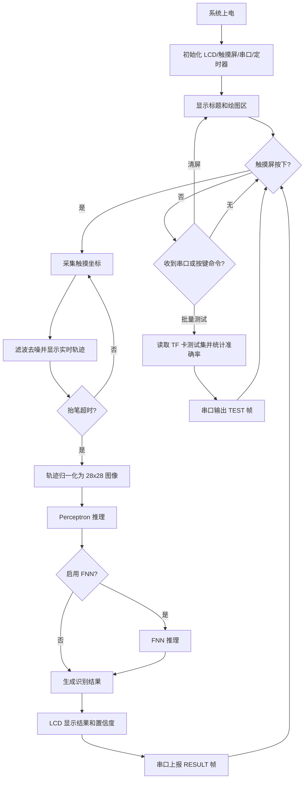
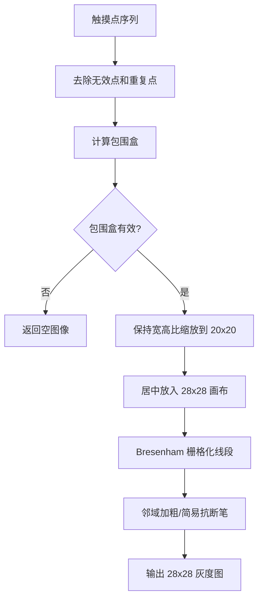
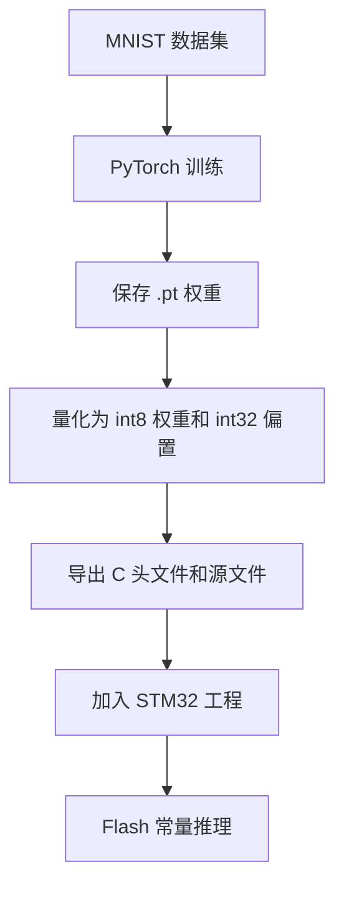

# 算法流程图

## 主程序流程

```mermaid
flowchart TD
    A[系统上电] --> B[初始化 LCD/触摸屏/串口/定时器]
    B --> C[显示标题和绘图区]
    C --> D{触摸屏按下?}
    D -- 否 --> E{收到串口或按键命令?}
    E -- 清屏 --> C
    E -- 批量测试 --> T[读取 TF 卡测试集并统计准确率]
    E -- 无 --> D
    D -- 是 --> F[采集触摸坐标]
    F --> G[滤波去噪并显示实时轨迹]
    G --> H{抬笔超时?}
    H -- 否 --> F
    H -- 是 --> I[轨迹归一化为 28x28 图像]
    I --> J[Perceptron 推理]
    J --> K{启用 FNN?}
    K -- 是 --> L[FNN 推理]
    K -- 否 --> M[生成识别结果]
    L --> M
    M --> N[LCD 显示结果和置信度]
    N --> O[串口上报 RESULT 帧]
    O --> D
    T --> P[串口输出 TEST 帧]
    P --> D
```

## 预处理流程

```mermaid
flowchart TD
    A[触摸点序列] --> B[去除无效点和重复点]
    B --> C[计算包围盒]
    C --> D{包围盒有效?}
    D -- 否 --> E[返回空图像]
    D -- 是 --> F[保持宽高比缩放到 20x20]
    F --> G[居中放入 28x28 画布]
    G --> H[Bresenham 栅格化线段]
    H --> I[邻域加粗/简易抗断笔]
    I --> J[输出 28x28 灰度图]
```

## 模型训练导出流程

```mermaid
flowchart TD
    A[MNIST 数据集] --> B[PyTorch 训练]
    B --> C[保存 .pt 权重]
    C --> D[量化为 int8 权重和 int32 偏置]
    D --> E[导出 C 头文件和源文件]
    E --> F[加入 STM32 工程]
    F --> G[Flash 常量推理]
```
