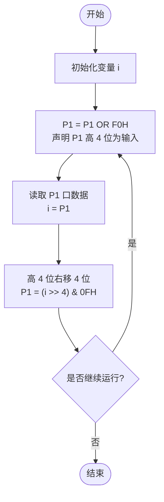
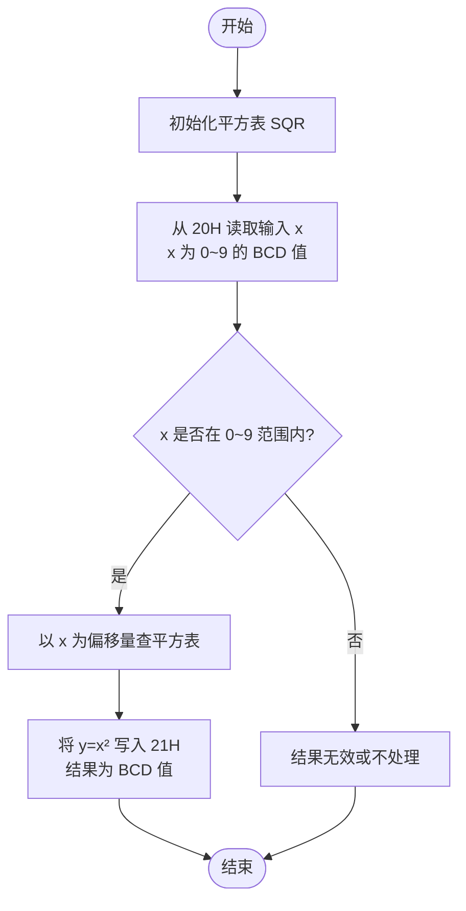
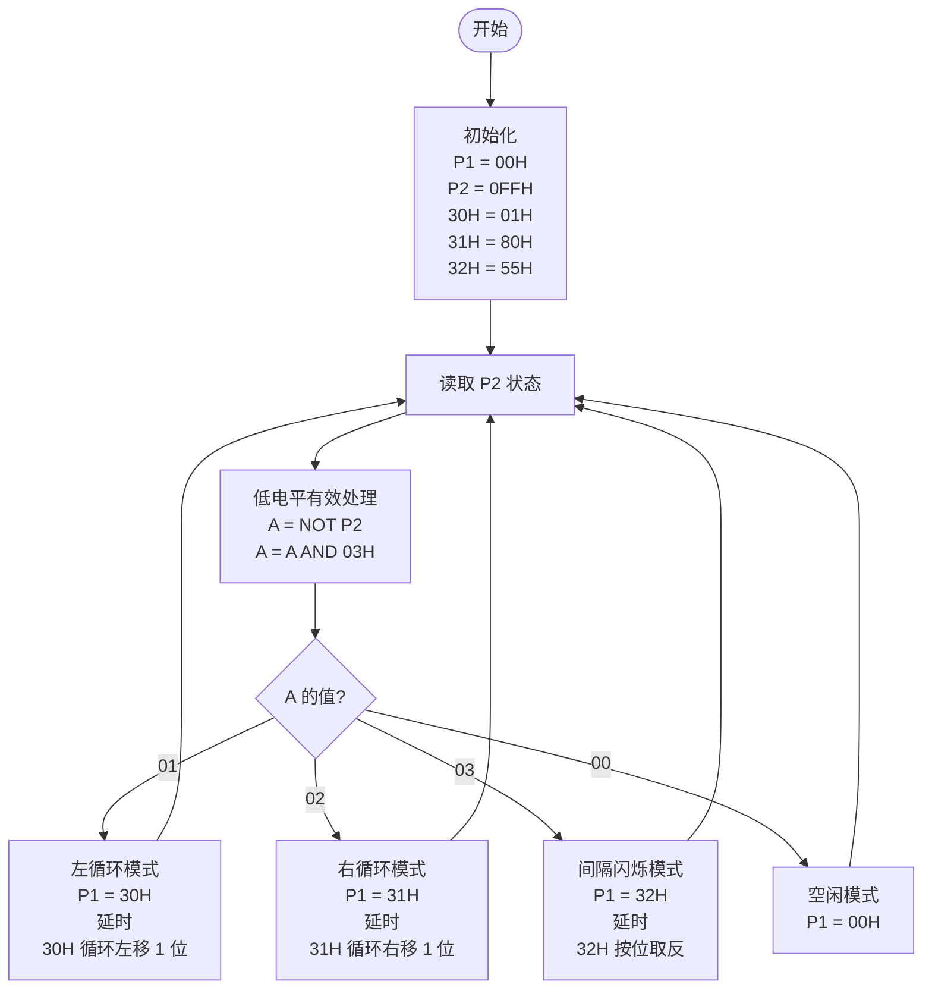
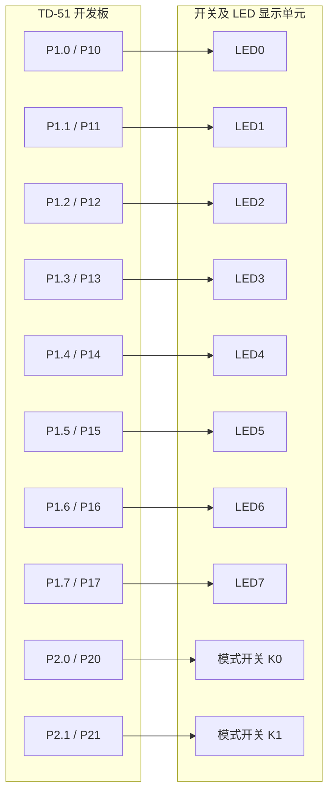

# 实验一算法流程图 Mermaid 代码

说明：
- 以下流程图按实验一实际完成内容整理，适合直接放入实验报告“实验线路示图、程序算法流程图”部分。
- 语法参考 Mermaid 官方 `flowchart` 规范，节点采用“开始/结束、处理、判断”三类基本形状，便于报告排版和教师阅读。
- 如果报告篇幅有限，建议至少保留 `3.1 数字量输入输出实验` 和 `提高题 2 LED 模式控制` 两张流程图。

## 1. 3.1 数字量输入输出实验流程图

适用说明：
- 对应 `DigitIO.c`。
- 核心逻辑是“高 4 位输入，低 4 位输出显示”。

---

## 2. 提高题 1：x=0~9 时 y=x² 的 BCD 查表流程图

适用说明：
- 对应 `Exp1_Improve1.asm`。
- 如果老师不强调异常输入处理，报告中可只保留“读取 x -> 查表 -> 输出 y”主路径。

---

## 3. 提高题 2：LED 左循环、右循环、间隔闪烁流程图

适用说明：
- 对应 `Exp1_Improve2.asm`。
- 该图最适合放在报告中作为“主算法流程图”，因为它同时体现了初始化、输入判断、模式分支和循环控制。

---

## 4. 报告里配图时的简短图注建议

- 图 1  数字量输入输出实验程序流程图
- 图 2  BCD 平方查表程序流程图
- 图 3  LED 模式控制程序流程图

---

## 5. 提高题 2 实验线路图（接线示意）

说明：
- `P1.0 ~ P1.7` 分别连接 8 个 LED，用于显示左循环、右循环和间隔闪烁效果。
- `P2.0`、`P2.1` 分别连接两个模式选择开关。
- 按本实验程序约定，模式开关采用低电平有效：
  - 仅 `K0` 有效：左循环
  - 仅 `K1` 有效：右循环
  - `K0` 与 `K1` 同时有效：间隔闪烁
  - 两个开关都无效：LED 熄灭
- 如果实际实验箱丝印使用的是 `D0 ~ D7` 或 `L0 ~ L7`，报告中统一写成 “8 个 LED 显示端” 即可。
