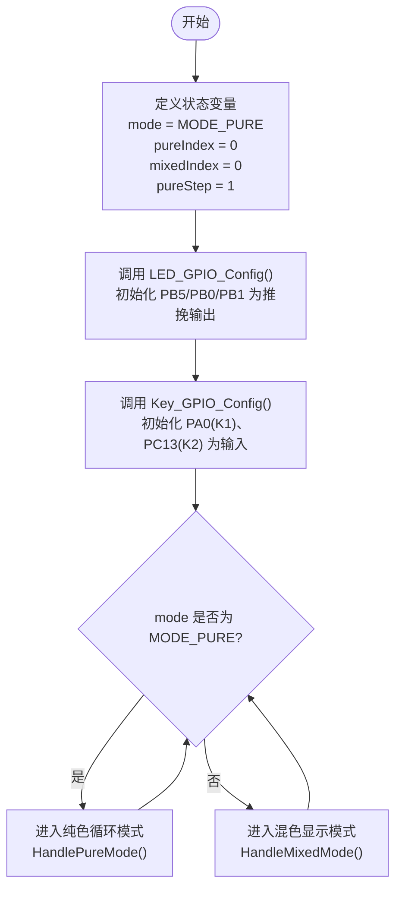
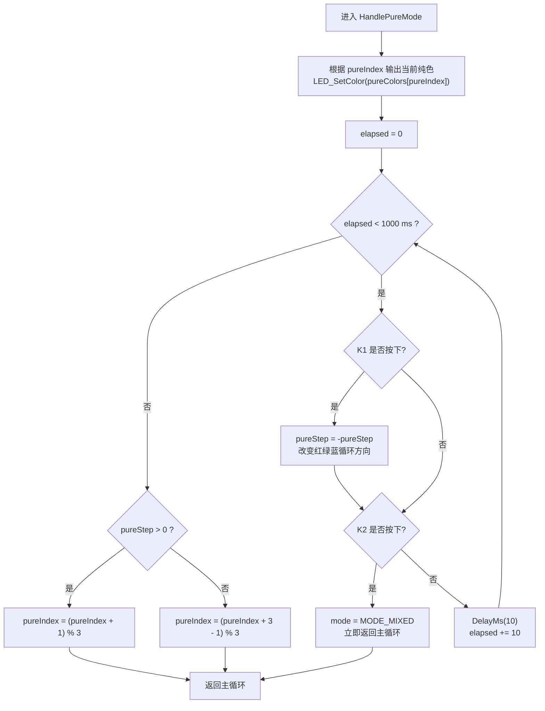
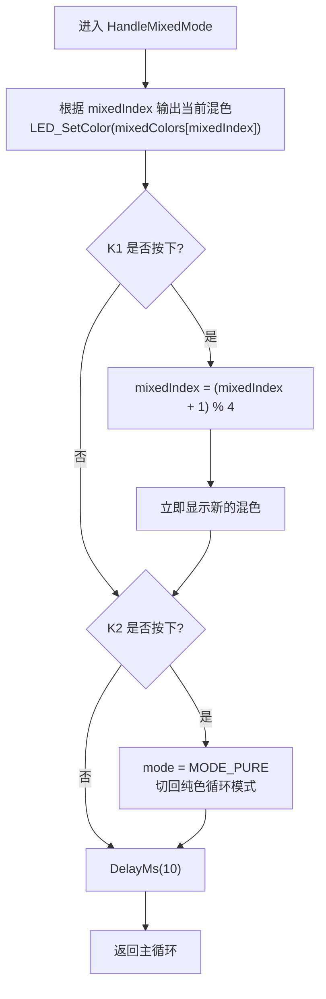
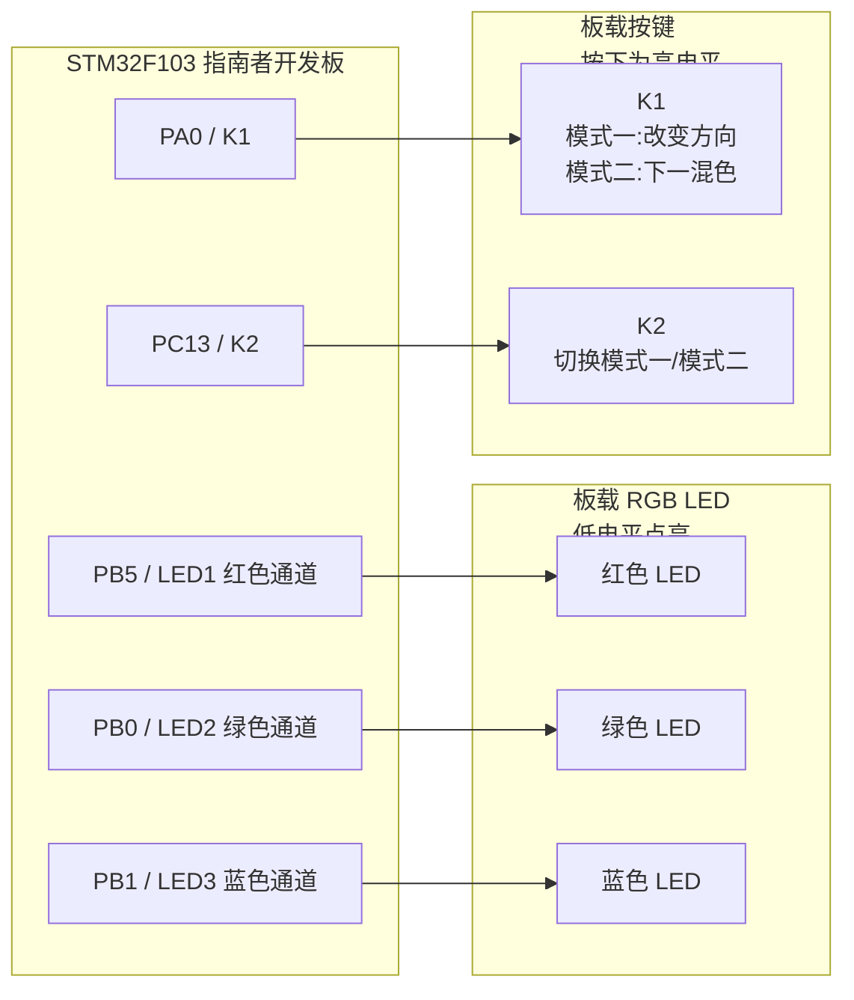
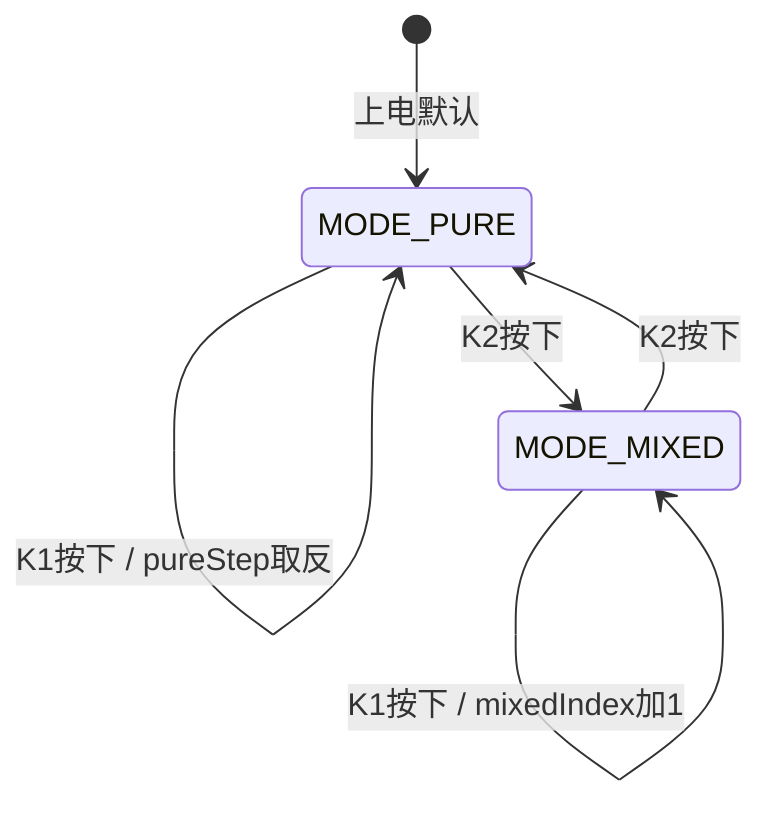

# STM32实验一算法流程图 Mermaid 代码

本文档依据 `EX11/User/main.c`、`bsp_led.h` 和 `bsp_key.h` 整理，适合放入实验报告“实验线路示图、程序算法流程图”部分。实验一提高题实现 RGB LED 双模式控制：模式一为红、绿、蓝纯色循环，模式二为黄、紫、青、白混色切换；K1 用于改变当前模式内的显示状态，K2 用于切换模式。

## 1. 主程序总体流程图

适用说明：
- `mode` 是主状态变量，用来区分当前处于纯色循环模式还是混色显示模式。
- `pureIndex` 表示当前纯色序号，0/1/2 分别对应红、绿、蓝。
- `mixedIndex` 表示当前混色序号，0/1/2/3 分别对应黄、紫、青、白。
- `pureStep` 表示纯色循环方向，值为 `1` 时正向循环，值为 `-1` 时反向循环。

## 2. 提高题模式一：纯色循环流程图

适用说明：
- 每种纯色理论保持 1 秒，但程序没有直接阻塞 1 秒，而是拆成 100 次 10 ms 轮询。
- 在 1 秒等待过程中仍持续扫描 K1/K2，所以按键响应不会等到 1 秒结束才发生。
- K1 不直接改变颜色，而是改变后续循环方向，例如红 -> 绿 -> 蓝可以变为红 -> 蓝 -> 绿。
- K2 在任意 10 ms 轮询周期内按下，都会立即切换到混色模式。

## 3. 提高题模式二：混色切换流程图

适用说明：
- 混色数组 `mixedColors` 中的顺序为黄、紫、青、白。
- K1 每按一次，混色序号加 1 并对 4 取余，实现循环切换。
- K2 用于返回模式一，返回后纯色循环会从当前 `pureIndex` 和 `pureStep` 继续运行。

## 4. RGB LED 与按键控制逻辑图

说明：
- RGB LED 为低电平点亮，因此驱动函数内部通过 `BRR` 置低电平点亮，通过 `BSRR` 置高电平熄灭。
- 红、绿、蓝三个通道组合后可显示混色：
  - 黄 = 红 + 绿
  - 紫 = 红 + 蓝
  - 青 = 绿 + 蓝
  - 白 = 红 + 绿 + 蓝

## 5. 模式状态转换图

适用说明：
- 该图适合在报告中解释 `mode` 状态变量的来源和变化。
- `mode` 不是由硬件自动产生的，而是程序根据 K2 按键扫描结果在两个枚举值之间切换。

## 6. 报告中推荐放置方式

- 主程序总体流程图：说明 `main()` 的整体结构。
- 纯色循环流程图：说明 K1 改变循环方向、K2 切换模式。
- 混色切换流程图：说明 K1 切换混色、K2 返回纯色模式。
- RGB LED 与按键控制逻辑图：作为实验线路示意图使用。
