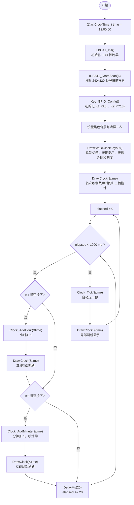
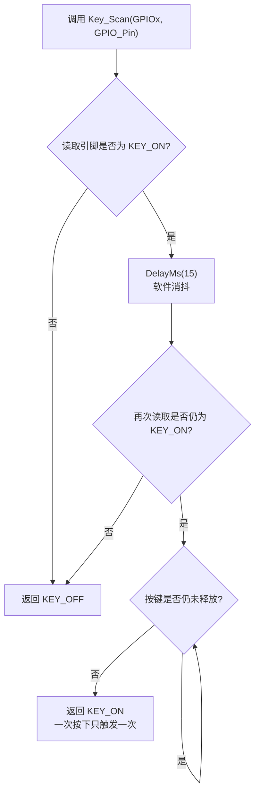
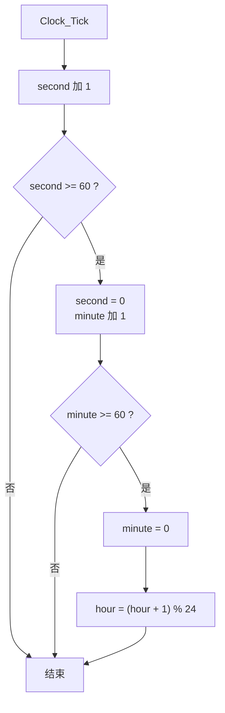
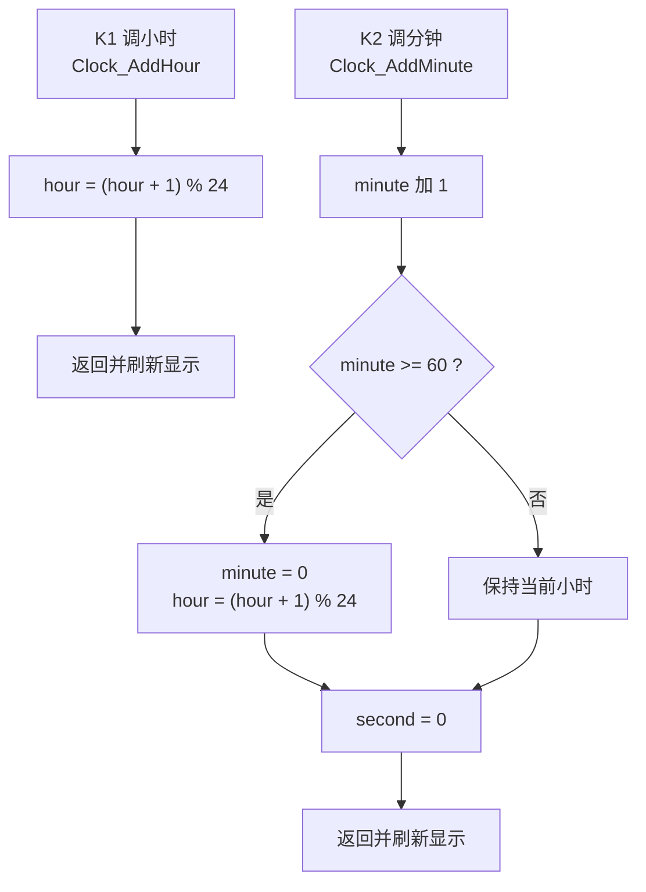
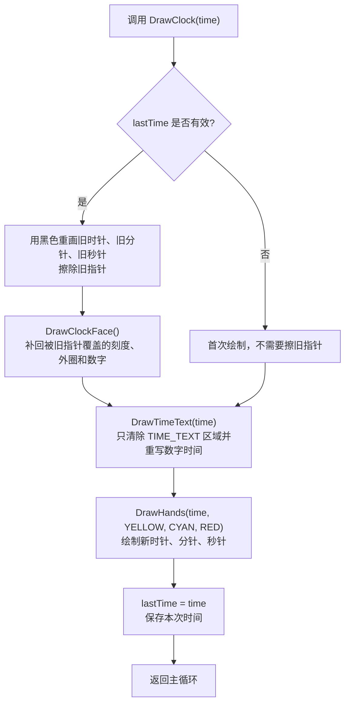
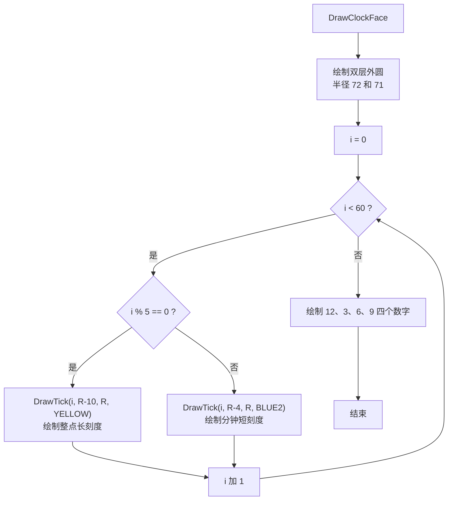
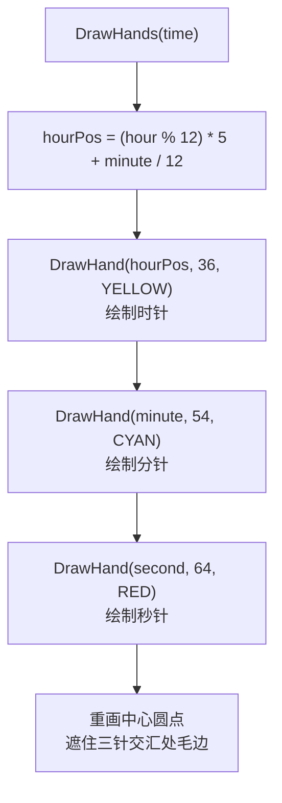
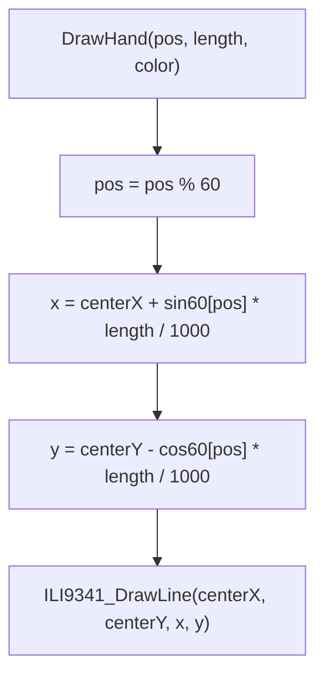
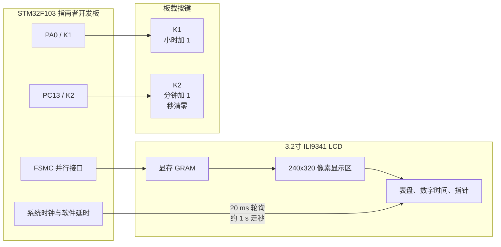

# STM32实验二算法流程图 Mermaid 代码

本文档依据 `EX112/User/main.c` 整理，适合放入实验报告“实验线路示图、程序算法流程图”部分。实验二提高题实现 LCD 数字时钟与 12 小时制表盘显示：顶部显示标题 `jinyifan`，中部显示 `时:分:秒`，下半部分绘制表盘、刻度和时分秒三根指针；K1 调小时，K2 调分钟并清零秒；显示刷新采用局部更新，避免每秒整屏闪烁。

## 1. 主程序总体流程图

适用说明：
- 程序把 1 秒拆成 50 个 20 ms 轮询周期，因此等待走秒时仍能及时响应按键。
- 开机只执行一次全屏清屏，后续只刷新数字时间区域和指针，避免整屏闪烁。
- K1 调整小时，K2 调整分钟，分钟调整后秒清零，符合手动校时习惯。

## 2. 按键扫描与消抖流程图

适用说明：
- 野火指南者板上 K1、K2 按下为高电平，所以 `KEY_ON` 定义为 1。
- 等待按键释放的设计可以防止长按时在主循环中被连续识别成多次短按。

## 3. 时间更新流程图

适用说明：
- 程序内部按 24 小时制保存时间。
- 表盘绘制时再通过 `hour % 12` 转换为 12 小时制位置。

## 4. LCD 局部刷新流程图

适用说明：
- 旧指针用黑色擦除，新指针用不同颜色绘制。
- 数字时间区域通过 `ILI9341_Clear(TIME_TEXT_X, TIME_TEXT_Y, TIME_TEXT_W, TIME_TEXT_H)` 局部清除。
- 该方法避免每秒调用整屏清屏，因此表盘不会出现明显闪烁。

## 5. 表盘绘制与指针坐标计算流程图

适用说明：
- `sin60[]` 和 `cos60[]` 是把圆周 60 等分后的查表结果，数值放大 1000 倍。
- LCD 坐标系的 Y 轴向下，所以计算 Y 坐标时使用 `centerY - cos60[pos] * length / 1000`。
- 时针位置加入 `minute / 12`，使时针不会只在整点跳变，而是随分钟缓慢移动。

## 6. LCD 时钟模块连接示意图

说明：
- LCD 由 `ILI9341_Init()` 完成初始化，由 `ILI9341_GramScan(6)` 设置竖屏扫描方向。
- 固定内容包括标题、底部按键提示、表盘外圆和刻度；动态内容包括数字时间和三根指针。

## 7. 报告中推荐放置方式

- 主程序总体流程图：说明 LCD 时钟的初始化、按键轮询和走秒逻辑。
- LCD 局部刷新流程图：突出“不整屏清屏、不闪烁”的改进点。
- 表盘绘制与指针坐标计算流程图：说明表盘、刻度和三根指针的具体绘制方法。
- LCD 时钟模块连接示意图：作为实验线路/模块关系示意图使用。
