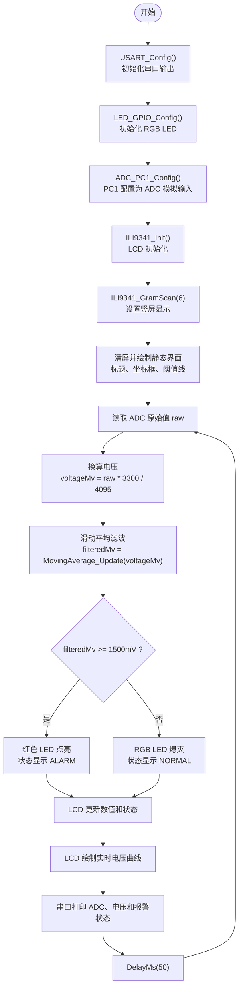
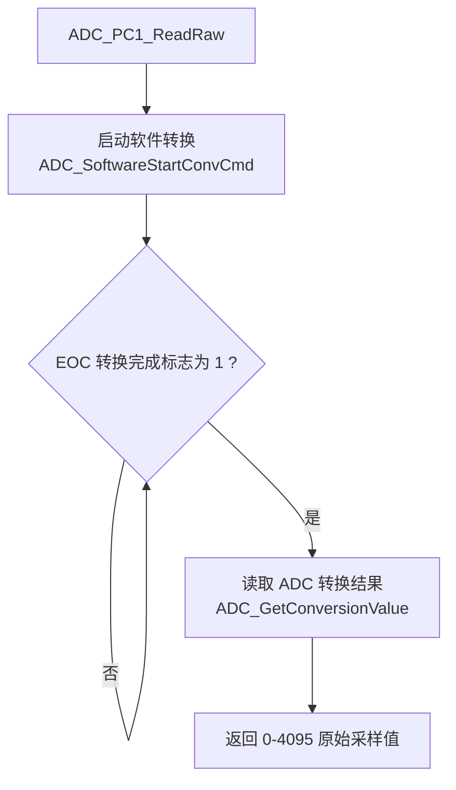
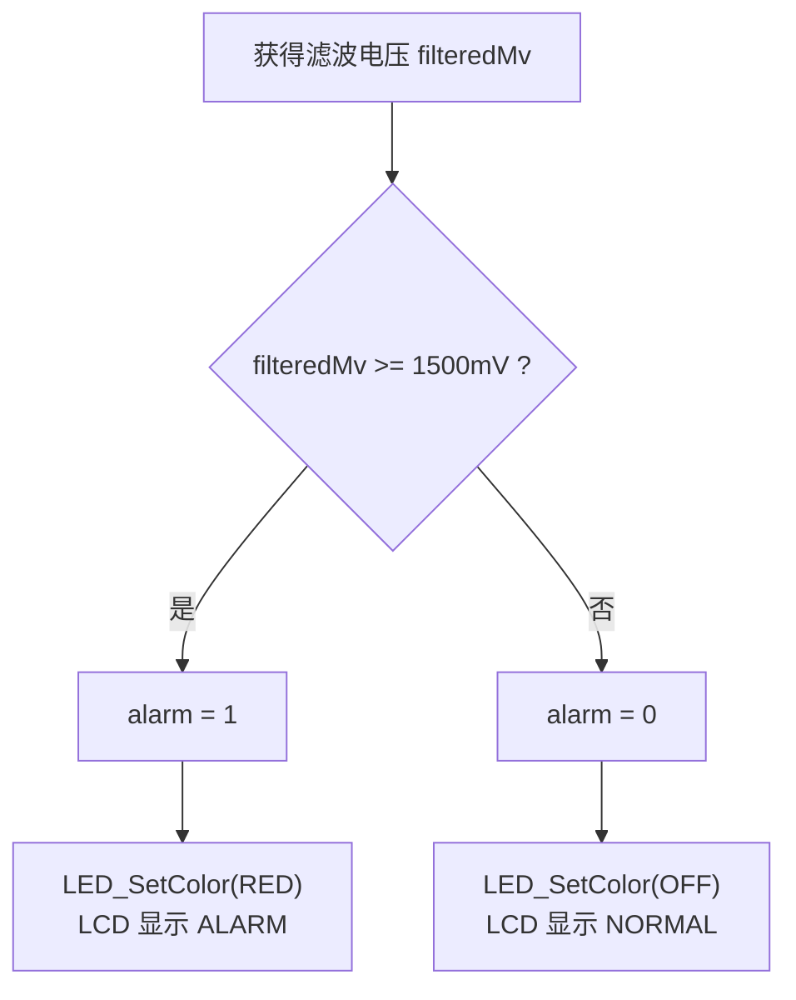
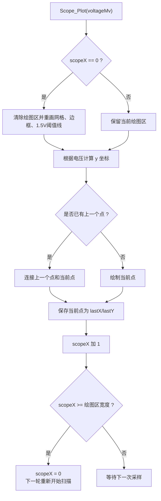
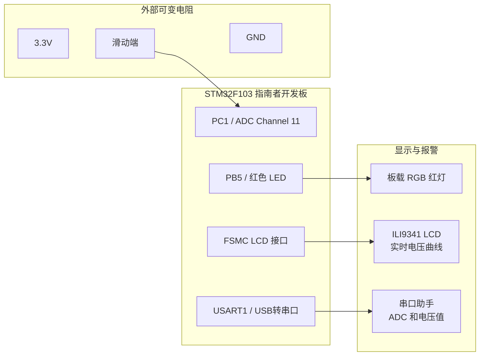

# STM32实验三提高题算法流程图 Mermaid 代码

本文档依据 `EX13/User/main.c` 整理，只描述实验三 A/D 实验提高题：PC1 采集模拟电压、超过阈值红灯报警、LCD 绘制实时电压曲线，并通过串口输出采样结果。

## 1. 主程序总体流程图

## 2. ADC 单次采样流程图

## 3. 火警报警判断流程图

## 4. LCD 简易示波器绘制流程图

## 5. 硬件连接示意图

说明：
- 可变电阻两端接 3.3V 和 GND，中间滑动端接 PC1。
- PC1 对应 ADC 通道 11，采样范围为 0-3.3V。
- 当滤波电压大于等于 1.5V 时，板载 RGB 红灯点亮报警。
