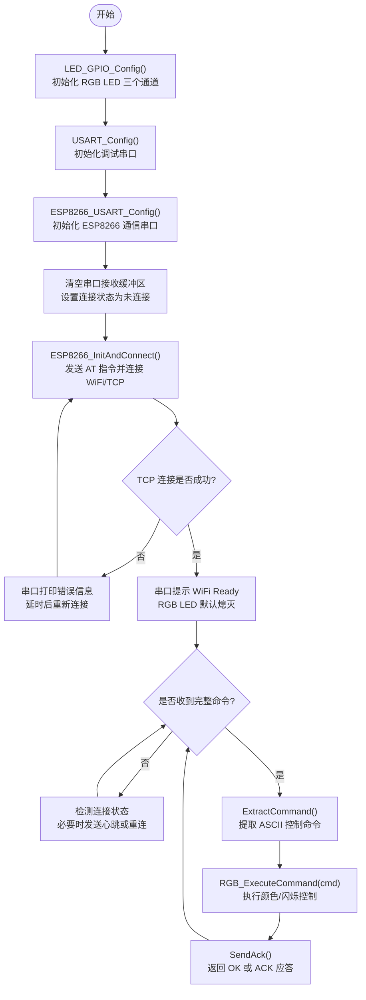
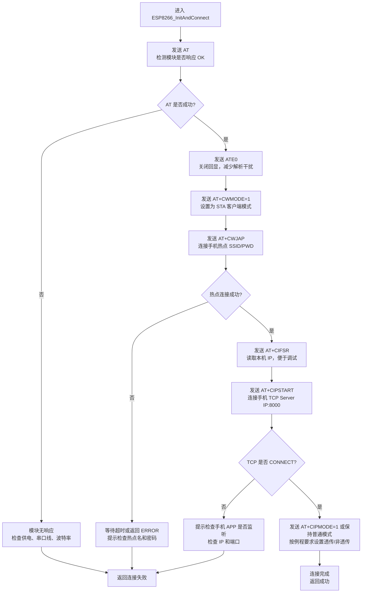
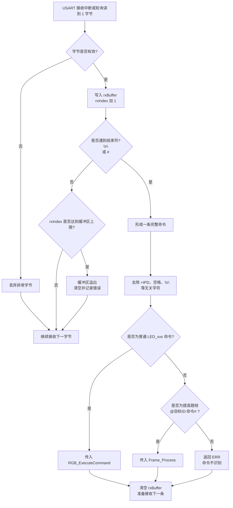
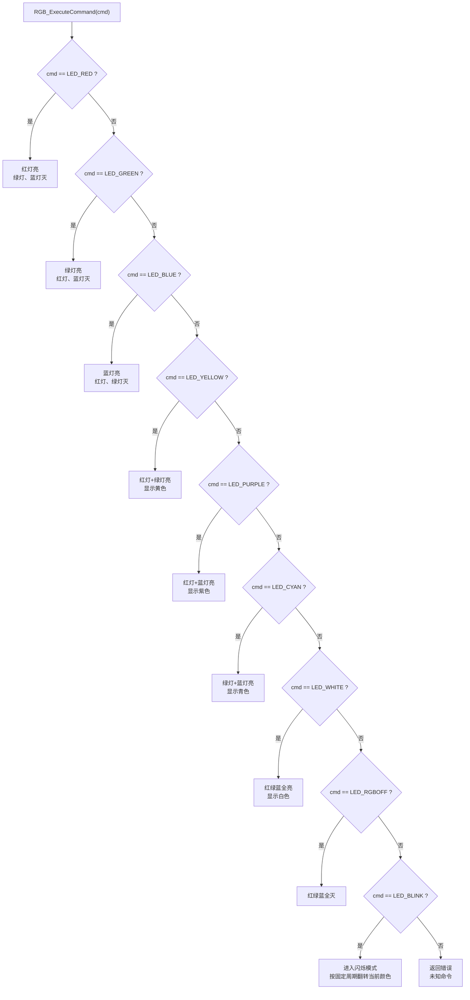
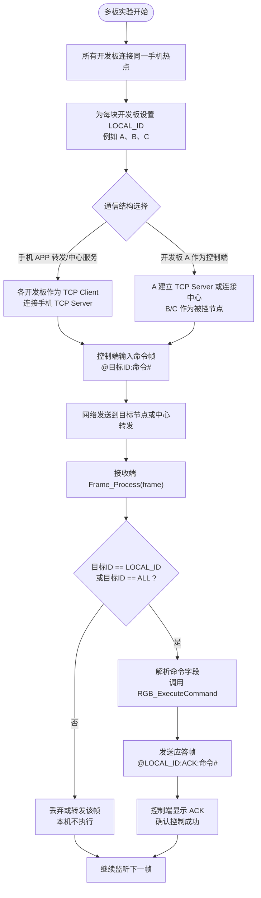
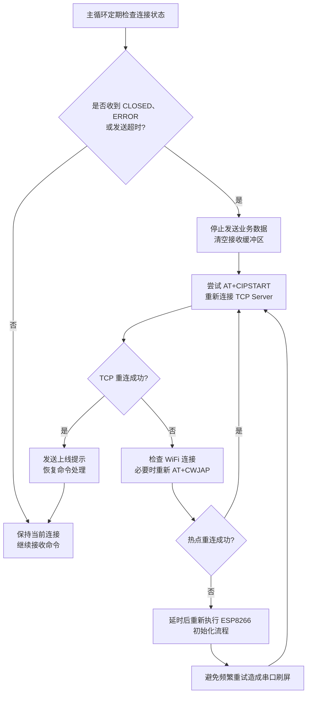
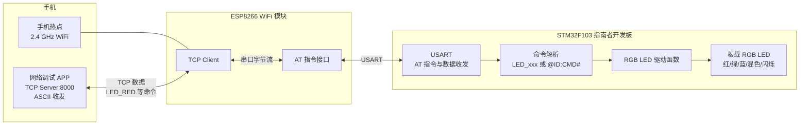

# STM32实验四 WiFi实验算法流程图 Mermaid 代码

本文档依据 `EX14/Paper/stm32_exp4_report.docx` 整理，适合放入实验报告“三、实验线路示图、程序算法流程图”部分。实验四实现 STM32 通过 ESP8266 连接手机热点，手机网络调试 APP 作为 TCP 服务端发送 ASCII 指令，开发板解析指令并控制板载 RGB LED；提高题扩展为多块开发板之间通过 WiFi 命令帧互相控制 RGB 灯。

## 1. 主程序总体流程图



适用说明：
- 初始化顺序为 LED、调试串口、ESP8266 串口、WiFi/TCP 连接，先保证本地外设可用，再进入网络通信。
- 主循环不直接阻塞等待某一个字节，而是持续检查接收缓冲区是否已经组成完整命令。
- 若 ESP8266 掉线或 TCP 断开，程序回到连接流程重新执行 AT 指令，避免实验过程中只能重新上电恢复。

## 2. ESP8266 AT 指令连接流程图



适用说明：
- `AT` 用来确认 ESP8266 模块和串口链路正常。
- `ATE0` 关闭回显后，STM32 接收缓冲区中不会重复出现自己发送的 AT 指令，后续解析更干净。
- `AT+CWMODE=1` 表示 ESP8266 作为 STA 连接手机热点；手机网络调试 APP 作为 TCP Server，开发板作为 TCP Client。
- 端口按实验要求使用 `8000`，IP 地址应填写手机 APP 显示的服务端地址或热点网关下分配的地址。

## 3. 网络接收与命令解析流程图



适用说明：
- TCP 是字节流，不能认为一次串口接收就等于一条完整命令，因此需要接收缓冲区和结束符判断。
- 基本题可直接使用 `LED_RED`、`LED_GREEN` 等字符串；提高题推荐使用 `@B:LED_RED#` 这种带帧头帧尾的格式。
- 若 APP 采用 ESP8266 非透传模式，接收数据前可能带有 `+IPD` 前缀，解析时应先提取真正的数据字段。

## 4. RGB LED 指令执行流程图



适用说明：
- 野火指南者板载 RGB LED 通常为低电平点亮，实际程序中应调用已有 LED 宏或封装函数，避免直接写 GPIO 时把亮灭逻辑写反。
- 黄、紫、青、白属于三色 LED 的组合显示：黄 = 红 + 绿，紫 = 红 + 蓝，青 = 绿 + 蓝，白 = 红 + 绿 + 蓝。
- `LED_BLINK` 是提高题可选扩展动作，可让被控端在收到命令后进入周期闪烁状态。

## 5. 提高题多开发板组网流程图



适用说明：
- 帧格式建议为 `@目标ID:命令#`，例如 `@B:LED_BLUE#` 控制 B 板蓝灯点亮，`@ALL:LED_RGBOFF#` 广播关闭所有 RGB 灯。
- 加入目标 ID 后，多块开发板接入同一网络时不会因为普通字符串命令产生歧义。
- 加入 ACK 应答后，控制端可以判断目标节点是否收到命令；若超时未收到 ACK，可重发或提示离线。

## 6. 命令帧解析状态机流程图

```mermaid
stateDiagram-v2
    [*] --> WAIT_HEAD
    WAIT_HEAD --> READ_TARGET: 收到 @
    WAIT_HEAD --> WAIT_HEAD: 其他字符丢弃
    READ_TARGET --> READ_COMMAND: 收到 :
    READ_TARGET --> WAIT_HEAD: 目标字段过长或非法
    READ_COMMAND --> FRAME_DONE: 收到 #
    READ_COMMAND --> WAIT_HEAD: 命令字段过长或非法
    FRAME_DONE --> EXECUTE: 校验目标ID和命令
    EXECUTE --> SEND_ACK: 本机需要执行
    EXECUTE --> WAIT_HEAD: 本机不需要执行
    SEND_ACK --> WAIT_HEAD: 应答发送完成
```

适用说明：
- 状态机比一次性字符串查找更适合串口/WiFi 字节流，因为它能处理半包、粘包和杂散字符。
- `WAIT_HEAD` 只等待帧头 `@`，遇到其他字符直接丢弃。
- `FRAME_DONE` 后再判断目标 ID，可以支持单播和 `ALL` 广播两种模式。

## 7. WiFi 通信异常处理流程图



适用说明：
- WiFi 实验常见故障包括热点密码错误、手机 APP 未监听、IP 地址写错、ESP8266 供电不足和串口波特率不一致。
- 程序检测到 `CLOSED`、`ERROR` 或发送超时后，不应继续把 LED 命令写入断开的 TCP 链路，而应先恢复连接。
- 重连时加入短延时可以避免连续发送 AT 指令导致 ESP8266 响应混乱。

## 8. 硬件与数据流关系示意图



说明：
- 手机热点负责提供局域网，网络调试 APP 负责监听 TCP 端口并发送 ASCII 命令。
- ESP8266 负责 WiFi 和 TCP 连接，STM32 通过 USART 发送 AT 指令并接收网络数据。
- STM32 不直接处理 WiFi 射频细节，只需要解析 ESP8266 串口返回的数据，并把命令映射为 RGB LED 控制。

## 9. 报告中推荐放置方式

- 主程序总体流程图：说明 STM32 初始化、连接 ESP8266、接收命令、执行 LED 控制的整体结构。
- ESP8266 AT 指令连接流程图：说明从 `AT` 检测到 `CIPSTART` 建立 TCP 连接的关键步骤。
- 网络接收与命令解析流程图：解释为什么要使用接收缓冲区和结束符判断。
- RGB LED 指令执行流程图：说明基本题中手机 APP 指令如何映射到板载 RGB 灯颜色。
- 提高题多开发板组网流程图和命令帧状态机：突出多板互控时的目标 ID、ACK 和广播控制设计。
- 硬件与数据流关系示意图：可作为实验线路图或系统框图使用。
