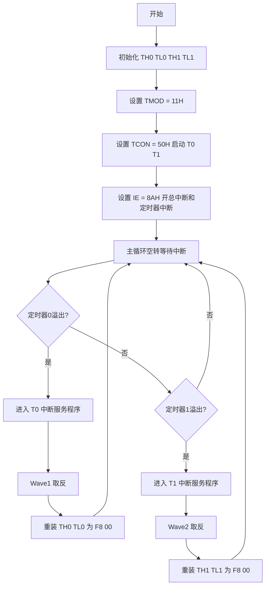
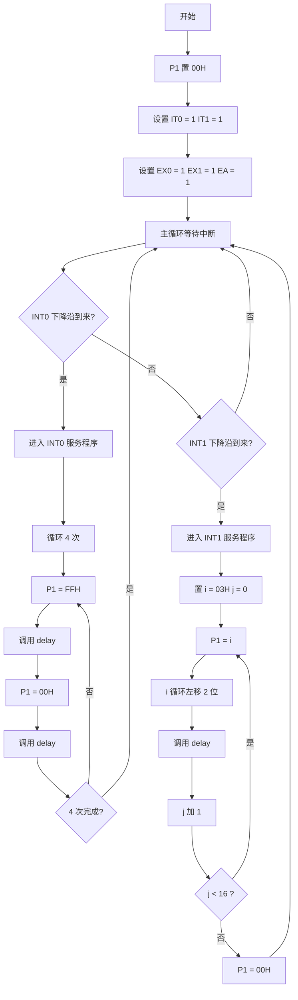
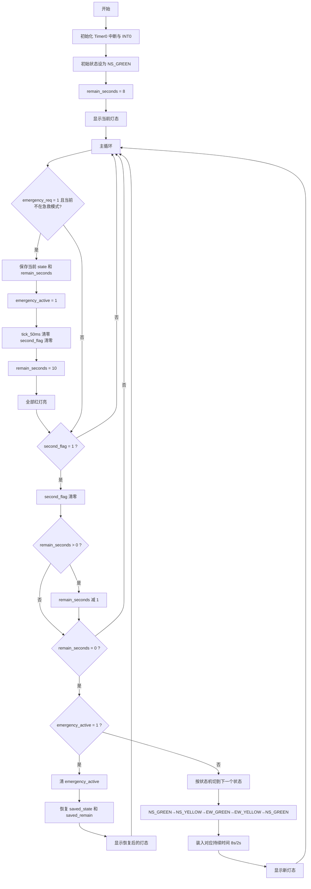
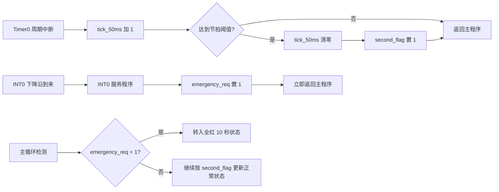
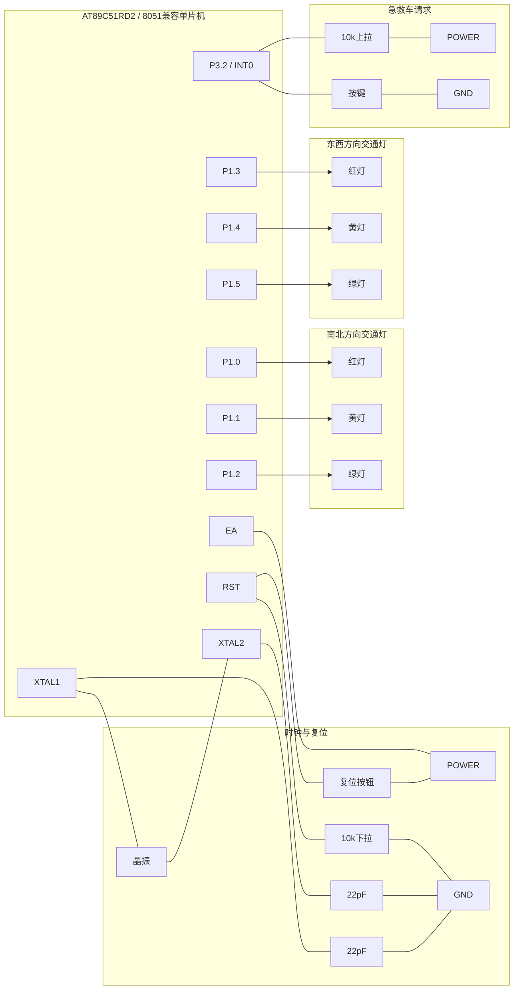

# 实验二算法流程图 Mermaid 代码

本文档依据《2026微控制器与嵌入式系统实验任务书（适用于自动化、测控2024级）》和《单片机实验指导》实验二要求整理，包含实验二基础题与提高题的算法流程图以及提高题 Proteus 接线示意，便于直接复制到支持 Mermaid 的编辑器中渲染。

## 1. 基础题1：定时器中断方波输出流程图

适用说明：
- 对应 `EX2_Int1.c`
- 输出端口为 `P1.0` 与 `P1.1`
- 结果可在 Keil Logic Analyzer 中观察两路方波

## 2. 基础题2：外部中断 LED 控制流程图

适用说明：
- 对应 `EX2_INT2.c`
- `INT0` 触发 8 个 LED 全亮全灭闪烁 4 次
- `INT1` 触发两灯一组循环左移显示

## 3. 提高题：交通灯主状态机流程图

适用说明：
- 对应 `EX2_Traffic_Emergency.c`
- `P1.0~P1.5` 分别驱动南北、东西两个方向的红黄绿灯
- `INT0` 作为急救车优先请求

## 4. 提高题：Timer0 与 INT0 协同流程图

适用说明：
- 本图强调“中断提出请求，主循环完成控制”的设计思路
- 该结构避免在中断服务程序内执行复杂延时与状态恢复逻辑

## 5. 提高题 Proteus 交通灯接线示意图

适用说明：
- 该接线示意与已保存的 Proteus 工程 `EX2_Traffic_Emergency.pdsprj` 一致
- `INT0` 采用按键下拉方式形成下降沿触发
- 复位键采用高电平复位，与 `INT0` 按键的极性不同

## 6. 报告中推荐放置方式

- 基础题至少放 2 张流程图：
  - 定时器中断方波输出流程图
  - 外部中断 LED 控制流程图
- 提高题建议放 2 张图：
  - 交通灯主状态机流程图
  - Proteus 交通灯接线示意图
- 若版面允许，可再补充“Timer0 与 INT0 协同流程图”以突出设计思路
