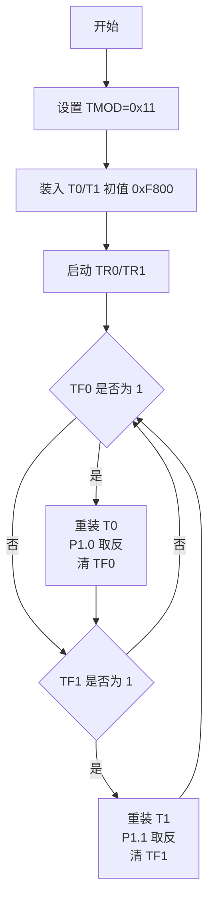
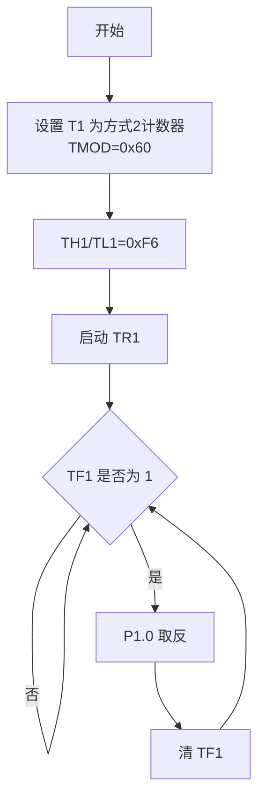
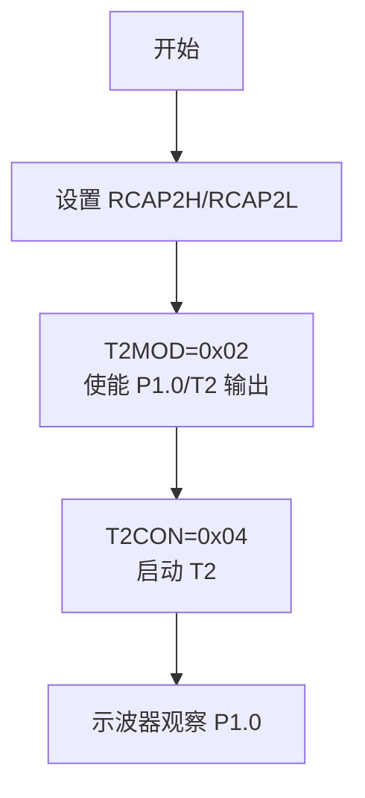
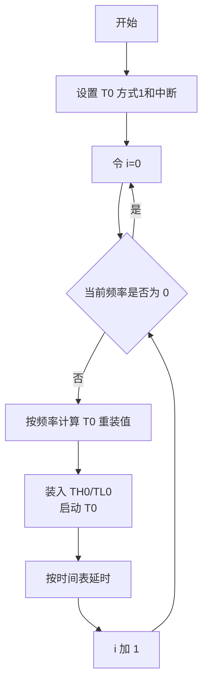
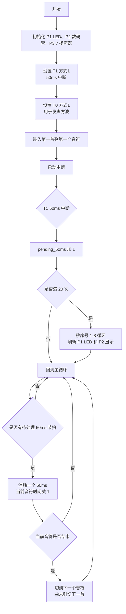

# 实验三算法流程图

## 基础题 1：定时器输出方波

```mermaid
flowchart TD
    A["开始"] --> B["设置 TMOD=0x11"]
    B --> C["装入 T0/T1 初值 0xF800"]
    C --> D["启动 TR0/TR1"]
    D --> E{"TF0 是否为 1"}
    E -- 是 --> F["重装 T0<br/>P1.0 取反<br/>清 TF0"]
    E -- 否 --> G{"TF1 是否为 1"}
    F --> G
    G -- 是 --> H["重装 T1<br/>P1.1 取反<br/>清 TF1"]
    G -- 否 --> E
    H --> E
```

## 基础题 2：计数器实验

```mermaid
flowchart TD
    A["开始"] --> B["设置 T1 为方式2计数器<br/>TMOD=0x60"]
    B --> C["TH1/TL1=0xF6"]
    C --> D["启动 TR1"]
    D --> E{"TF1 是否为 1"}
    E -- 否 --> E
    E -- 是 --> F["P1.0 取反"]
    F --> G["清 TF1"]
    G --> E
```

## 基础题 3：Timer2 可编程时钟输出

```mermaid
flowchart TD
    A["开始"] --> B["设置 RCAP2H/RCAP2L"]
    B --> C["T2MOD=0x02<br/>使能 P1.0/T2 输出"]
    C --> D["T2CON=0x04<br/>启动 T2"]
    D --> E["示波器观察 P1.0"]
```

## 基础题 4：电子发声

```mermaid
flowchart TD
    A["开始"] --> B["设置 T0 方式1和中断"]
    B --> C["令 i=0"]
    C --> D{"当前频率是否为 0"}
    D -- 是 --> C
    D -- 否 --> E["按频率计算 T0 重装值"]
    E --> F["装入 TH0/TL0<br/>启动 T0"]
    F --> G["按时间表延时"]
    G --> H["i 加 1"]
    H --> D
```

## 提高题：T1 50ms LED 时序 + 数码管 + 两首乐曲循环

```mermaid
flowchart TD
    A["开始"] --> B["初始化 P1 LED、P2 数码管、P3.7 扬声器"]
    B --> C["设置 T1 方式1<br/>50ms 中断"]
    C --> D["设置 T0 方式1<br/>用于发声方波"]
    D --> E["装入第一首歌第一个音符"]
    E --> F["启动中断"]
    F --> G{"T1 50ms 中断"}
    G --> H["pending_50ms 加 1"]
    H --> I{"是否满 20 次"}
    I -- 是 --> J["秒序号 1-8 循环<br/>刷新 P1 LED 和 P2 显示"]
    I -- 否 --> K["回到主循环"]
    J --> K
    K --> L{"是否有待处理 50ms 节拍"}
    L -- 是 --> M["消耗一个 50ms<br/>当前音符时间减 1"]
    M --> N{"当前音符是否结束"}
    N -- 是 --> O["切到下一个音符<br/>曲末则切下一首"]
    N -- 否 --> K
    O --> K
    L -- 否 --> K
```
