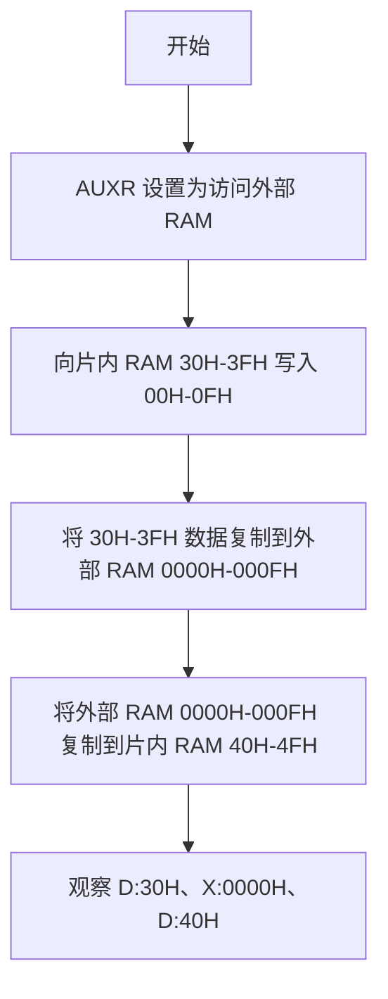
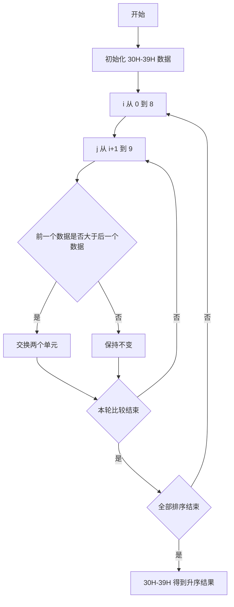
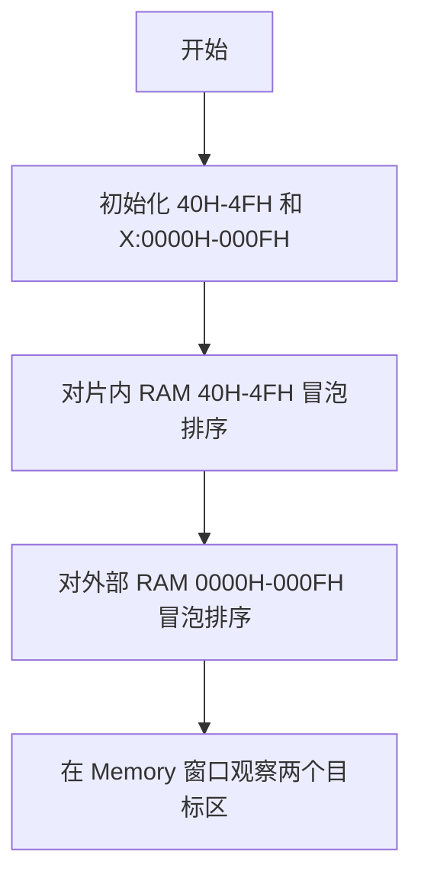
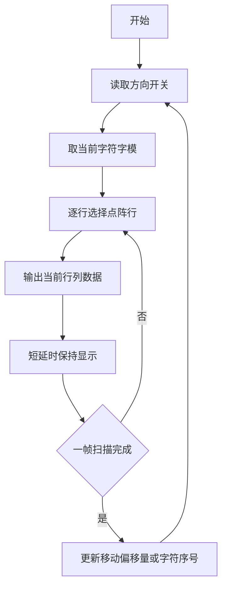

# 实验四算法流程图

## 基础题 1：静态存储器扩展

```mermaid
flowchart TD
    A["开始"] --> B["AUXR 设置为访问外部 RAM"]
    B --> C["向片内 RAM 30H-3FH 写入 00H-0FH"]
    C --> D["将 30H-3FH 数据复制到外部 RAM 0000H-000FH"]
    D --> E["将外部 RAM 0000H-000FH 复制到片内 RAM 40H-4FH"]
    E --> F["观察 D:30H、X:0000H、D:40H"]
```

## 基础题 2：片内 RAM 排序

```mermaid
flowchart TD
    A["开始"] --> B["初始化 30H-39H 数据"]
    B --> C["i 从 0 到 8"]
    C --> D["j 从 i+1 到 9"]
    D --> E{"前一个数据是否大于后一个数据"}
    E -- 是 --> F["交换两个单元"]
    E -- 否 --> G["保持不变"]
    F --> H{"本轮比较结束"}
    G --> H
    H -- 否 --> D
    H -- 是 --> I{"全部排序结束"}
    I -- 否 --> C
    I -- 是 --> J["30H-39H 得到升序结果"]
```

## 提高题 1：片内/外 RAM 升序排列

```mermaid
flowchart TD
    A["开始"] --> B["初始化 40H-4FH 和 X:0000H-000FH"]
    B --> C["对片内 RAM 40H-4FH 冒泡排序"]
    C --> D["对外部 RAM 0000H-000FH 冒泡排序"]
    D --> E["在 Memory 窗口观察两个目标区"]
```

## 点阵 LED 扫描显示

```mermaid
flowchart TD
    A["开始"] --> B["读取方向开关"]
    B --> C["取当前字符字模"]
    C --> D["逐行选择点阵行"]
    D --> E["输出当前行列数据"]
    E --> F["短延时保持显示"]
    F --> G{"一帧扫描完成"}
    G -- 否 --> D
    G -- 是 --> H["更新移动偏移量或字符序号"]
    H --> B
```
