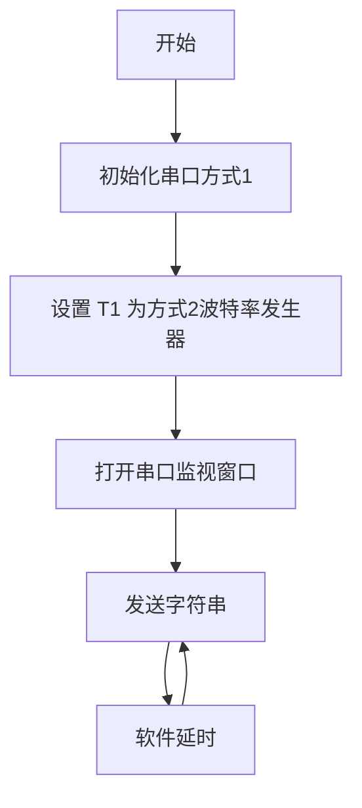
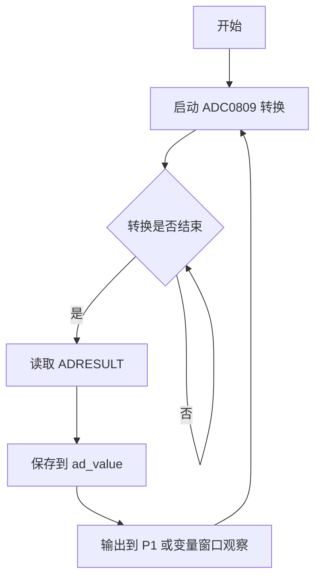
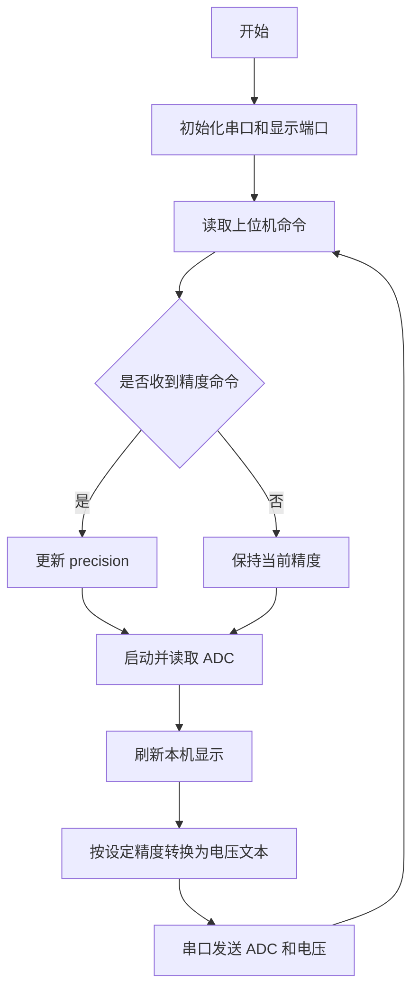

# 实验五算法流程图

## 基础题 1：串口通讯

```mermaid
flowchart TD
    A["开始"] --> B["初始化串口方式1"]
    B --> C["设置 T1 为方式2波特率发生器"]
    C --> D["打开串口监视窗口"]
    D --> E["发送字符串"]
    E --> F["软件延时"]
    F --> E
```

## 基础题 2：A/D 转换

```mermaid
flowchart TD
    A["开始"] --> B["启动 ADC0809 转换"]
    B --> C{"转换是否结束"}
    C -- 否 --> C
    C -- 是 --> D["读取 ADRESULT"]
    D --> E["保存到 ad_value"]
    E --> F["输出到 P1 或变量窗口观察"]
    F --> B
```

## 提高题：ADC + 串口 + 显示 + 精度控制

```mermaid
flowchart TD
    A["开始"] --> B["初始化串口和显示端口"]
    B --> C["读取上位机命令"]
    C --> D{"是否收到精度命令"}
    D -- 是 --> E["更新 precision"]
    D -- 否 --> F["保持当前精度"]
    E --> G["启动并读取 ADC"]
    F --> G
    G --> H["刷新本机显示"]
    H --> I["按设定精度转换为电压文本"]
    I --> J["串口发送 ADC 和电压"]
    J --> C
```
