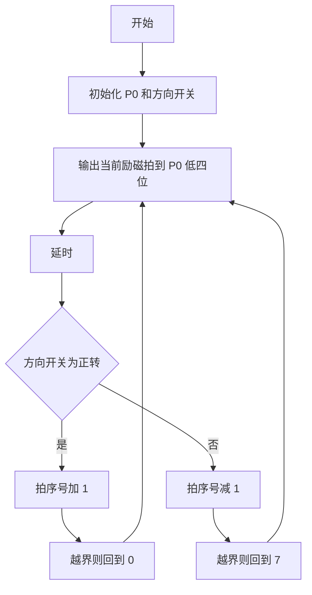
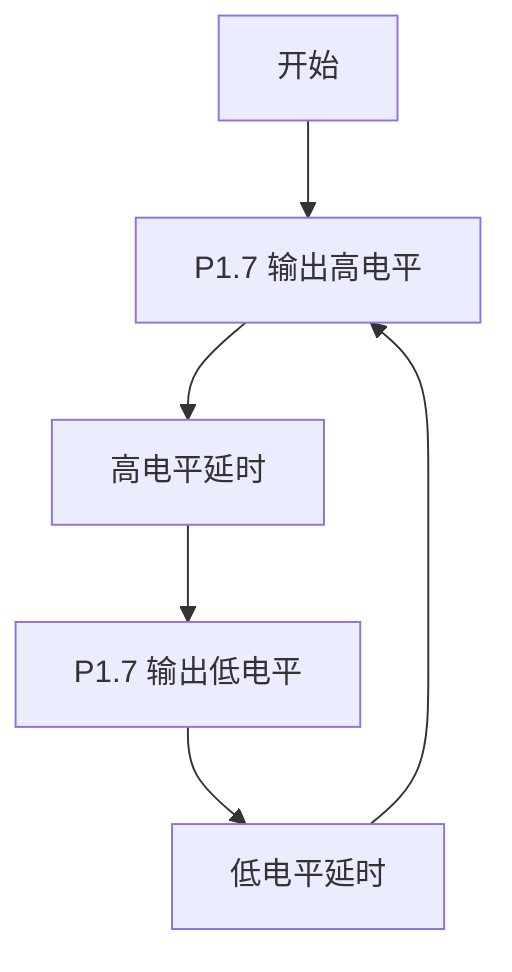
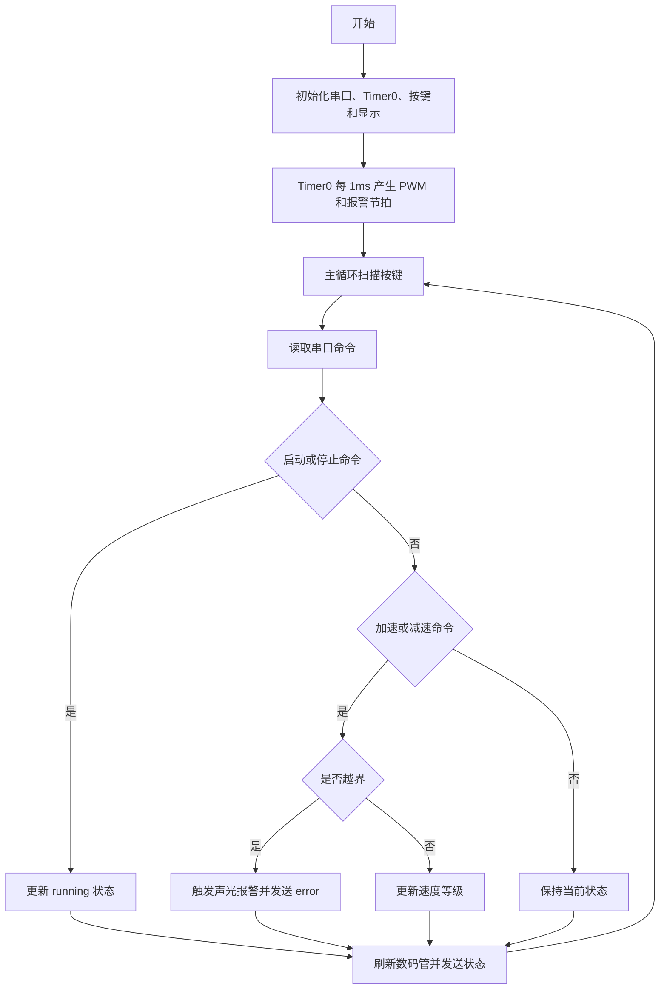

# 实验六算法流程图

## 基础题 1：步进电机

```mermaid
flowchart TD
    A["开始"] --> B["初始化 P0 和方向开关"]
    B --> C["输出当前励磁拍到 P0 低四位"]
    C --> D["延时"]
    D --> E{"方向开关为正转"}
    E -- 是 --> F["拍序号加 1"]
    E -- 否 --> G["拍序号减 1"]
    F --> H["越界则回到 0"]
    G --> I["越界则回到 7"]
    H --> C
    I --> C
```

## 基础题 2：直流电机 PWM

```mermaid
flowchart TD
    A["开始"] --> B["P1.7 输出高电平"]
    B --> C["高电平延时"]
    C --> D["P1.7 输出低电平"]
    D --> E["低电平延时"]
    E --> B
```

## 提高题：直流电机综合控制

```mermaid
flowchart TD
    A["开始"] --> B["初始化串口、Timer0、按键和显示"]
    B --> C["Timer0 每 1ms 产生 PWM 和报警节拍"]
    C --> D["主循环扫描按键"]
    D --> E["读取串口命令"]
    E --> F{"启动或停止命令"}
    F -- 是 --> G["更新 running 状态"]
    F -- 否 --> H{"加速或减速命令"}
    H -- 是 --> I{"是否越界"}
    I -- 是 --> J["触发声光报警并发送 error"]
    I -- 否 --> K["更新速度等级"]
    H -- 否 --> L["保持当前状态"]
    G --> M["刷新数码管并发送状态"]
    J --> M
    K --> M
    L --> M
    M --> D
```
